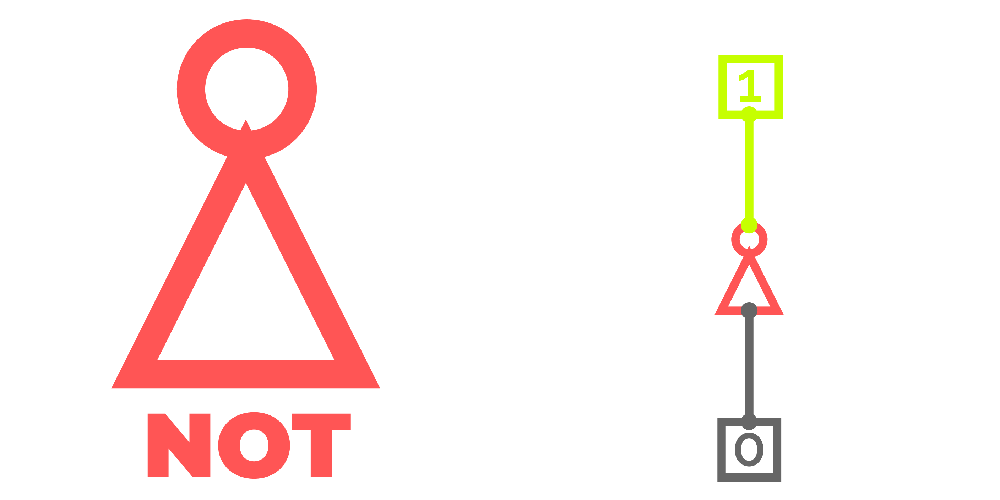
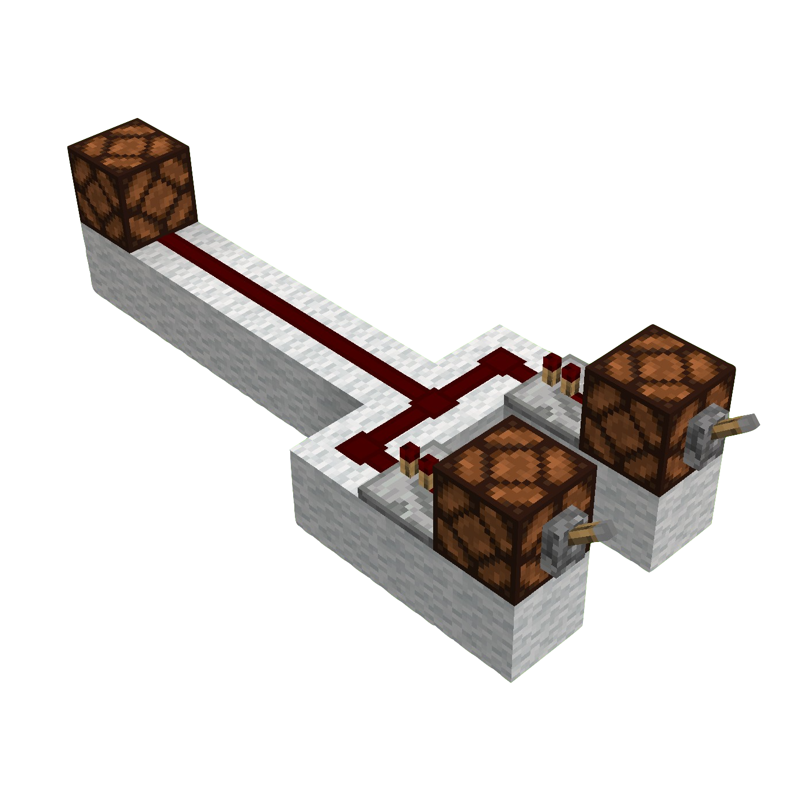
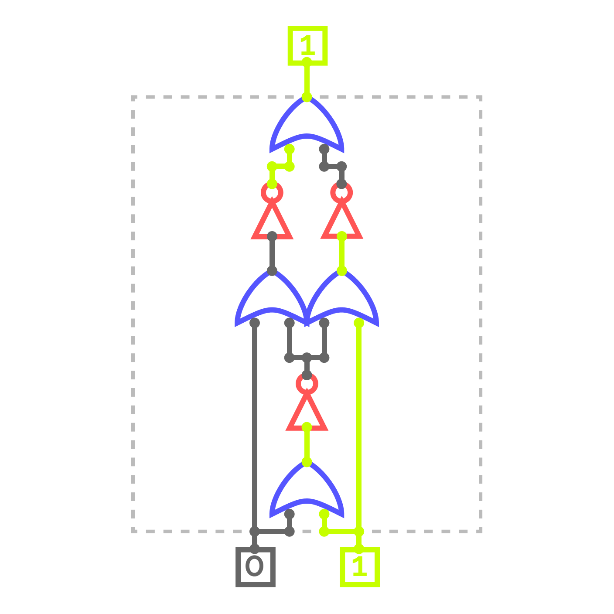
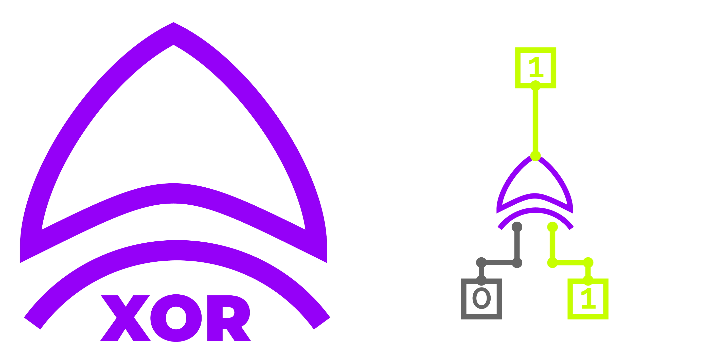
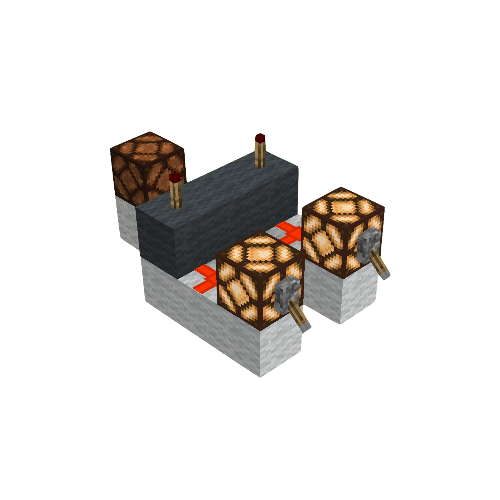
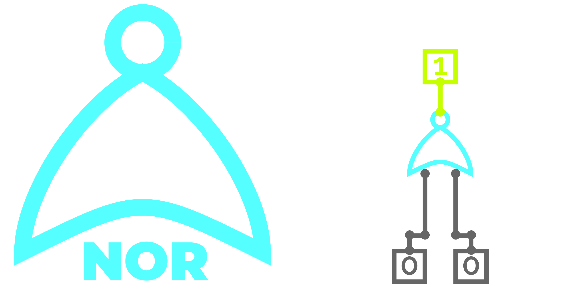
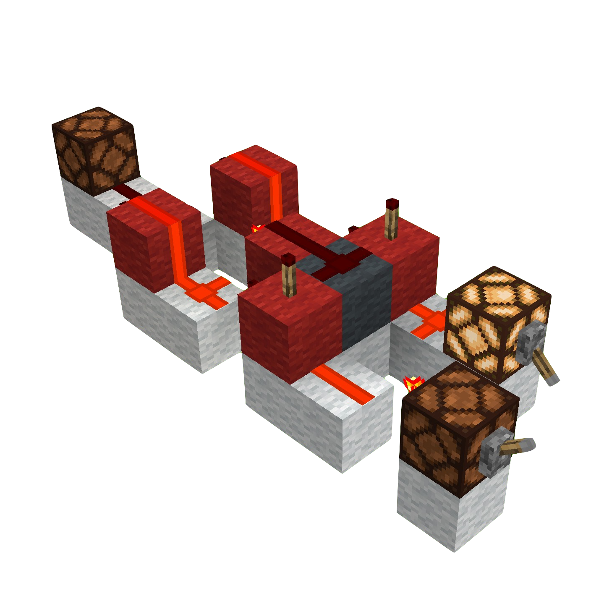

### Module 2: The Language of Logic – A Deep Dive into Boolean Algebra

---

#### Module Summary

-   **Narrative Beat:** We've built our keyboard, but to make the computer *think*, we need to learn its grammar. This isn't a Minecraft lesson; this is the fundamental language of all digital electronics. Welcome to Boolean Algebra.
-   **Learning Goals:**
    -   Move beyond physical blocks to understand the formal, abstract language that governs all digital circuits.
    -   Understand *why* circuits work the way they do, and how to design and simplify them on paper before ever placing a block.
-   **Lesson Overview:**
    -   Lesson 2.1: The Rules of Thought
    -   Lesson 2.2: The Core Operators (The Verbs of Logic)
    -   Lesson 2.3: The Laws of Logic & The Power of Simplification
    -   Lesson 2.4: The Special Operator – XOR
    -   Lesson 2.5: Software Superpowers – The XOR Trick for Programmers
    -   Lesson 2.6: The Negated Gates – NAND, NOR, and XNOR
    -   Lesson 2.7: Module 2 Checkpoint
-   **Minecraft Artifact:** A set of working Redstone logic gates (NOT, AND, OR, XOR, NAND, NOR, XNOR).

---

#### Module Introduction

*For our build philosophy and the story behind this course, see the [main course introduction](../README.md).*

---

Welcome back to Redstone University!

In our last module, we built a physical way to speak to our computer in binary. We have our keyboard, a set of four simple levers. But right now, those levers are connected to nothing. Our machine can't yet *understand* or *do* anything with the numbers we give it. It can hear us, but it doesn't know the language.

In this module, we're going to give our computer a mind. We're going to take a crucial journey into theory to learn the fundamental grammar of all digital logic. This isn't just a Minecraft lesson; this is the language that powers every computer chip ever made.

Welcome to Boolean Algebra.

---

#### Lesson 2.1: The Rules of Thought

> **Key Takeaway:** Boolean algebra gives us a precise language for describing and manipulating logical statements, which is the foundation of all digital circuits.

In the mid-1800s, a mathematician named George Boole developed a new kind of algebra. Unlike the algebra you might know from school, where variables like `x` and `y` can be any number, Boole's variables were much simpler. They could only have two possible values: **True** or **False**.

This system, now called **Boolean Algebra**, was initially a mathematical curiosity. But a century later, when engineers started building the first electronic computers with on/off switches, they realized Boole had already invented the perfect mathematical system to describe them.

-   **The Core Idea:** We'll treat our Redstone signals as Boolean variables.
-   A powered Redstone line is **True**. We'll also call this `1`.
-   An unpowered Redstone line is **False**. We'll also call this `0`.

Boolean algebra gives us a set of rules and operators to manipulate these True/False values. These physical operators are called **logic gates**, and they are the bedrock (pun intended) of all computation.

---

#### Lesson 2.2: The Core Operators (The Verbs of Logic)

**How We Describe Each Gate**

For each logic gate, we will start out with visuals and the formal definitions, then move to the truth table and Boolean expression. This will give us a complete understanding of the gate's function.

-   **Minecraft Gate:** A screenshot of the gate implemented in Minecraft.
-   **Circuit Diagram:** CircuitVerse diagram of the gate. Note for primitive gates, this will be a single gate with inputs and outputs. For composite gates, we will compose them from the primitive gates.
-   **Formal Definition:** The high-level concept and official terminology.
-   **Symbols:** The common ways this operator is written in logic and programming.
-   **The Rule:** A plain-English sentence describing what the gate does.
-   **Truth Table:** A complete chart defining the gate's behavior. This is the ultimate "source of truth."
-   **Boolean Expression:** The algebraic/logical representation of the gate's output.

-   **Lab & Experiment:** A hands-on test to verify the gate's function against its truth table.
-   **Real-World Connection:** An example of where this logic is used in real technology.

---

##### Operator 1: NOT (The Inverter)

> **Key Takeaway:** The NOT gate flips a signal, turning ON to OFF, or 1 to 0. It’s the simplest way to create “opposite” logic in a circuit.

-   **Minecraft Gate:**


*Figure: The **Redstone Torch** is a purpose-built NOT gate in Minecraft.*

-   **Circuit Diagram:**


*Figure: A single NOT gate with one input and one output, as shown in CircuitVerse.*

-   **Formal Definition:** The NOT gate, or Inverter, performs **Negation**. It's the simplest possible operation: it takes a single input and outputs its exact opposite.
-   **Symbols:** `¬A` (logic), `!A` (programming).
-   **The Rule:** If the input is `True`, the output is `False`. If the input is `False`, the output is `True`.
-   **Truth Table: NOT Gate**
    | `A` | `NOT A` |
    |:---:|:-------:|
    |  0  |   1     |
    |  1  |   0     |
-   **The Boolean Expression:** The output `Y` is simply `Y = !A`.

-   **Lab & Experiment:**
    > **Note:** The Redstone Torch itself is a physical NOT gate, but we will add some lamps and dust just to help visualize everything better. Feel free to use a simple torch moving forward if you prefer.

    1.  Build the circuit as shown in the Minecraft screenshot:

        1. Place a redstone lamp with a lever on one side to represent input `A`.
        2. On the backside of the lamp, place a redstone torch. This is the core component of the NOT gate.
        3. From the torch, run a line of redstone dust to another redstone lamp representing output `Y`.

        > **Note:** The torch itself is the critical component of the NOT gate. The extra lamps and dust are just for visualization.

    2.  Test the circuit:

        1. Set lever A to ON (1). Observe that the lamp is OFF (0).
        2. Set lever A to OFF (0). Observe that the lamp is ON (1).

    3.  **Verification:** The physical results perfectly match the truth table. You've built a working inverter! The extra lamps and dust we added should help visualize the NOT gate's function, but remember that the torch itself is the core component.

-   **Real-World Connection:** NOT gates are used everywhere, from creating the oscillating signal in a computer's clock (a "heartbeat") to flipping bits for representing negative numbers, which we'll do in a later module!

-   **Software Connection:** The NOT operation is used in programming to invert a condition or toggle a flag. For example, in Python:
    ```python
    is_on = False
    if not is_on:
        print("The device is off.")
    ```
    Here, `not` is the software equivalent of a NOT gate.

---

##### Operator 2: OR (The "At Least One" Gate)

> **Key Takeaway:** The OR gate outputs 1 if at least one input is 1. It’s how we express “either/or” logic in hardware and software.

- **Minecraft Gate:**
  
  *Figure: The classic Minecraft OR gate using Redstone Dust merging.*

- **Circuit Diagram:**
  
  *Figure: The OR gate as shown in CircuitVerse.*

- **Formal Definition:** The OR gate performs **Disjunction**. Think of it as the optimistic gate—it checks if *at least one* of its inputs is True.
- **Symbols:** `A ∨ B` (logic), `A || B` (programming).
- **The Rule:** The output is `True` if `A` is True, OR `B` is True, or if both are True.
- **Truth Table: OR Gate**
  | `A` | `B` | `A OR B` |
  |:---:|:---:|:--------:|
  |  0  |  0  |    0     |
  |  0  |  1  |    1     |
  |  1  |  0  |    1     |
  |  1  |  1  |    1     |
- **The Boolean Expression:** The output `Y` is `Y = A OR B`.
- **Lab & Experiment:**
    1. Build the circuit as shown in the Minecraft screenshot:

        1. Place two redstone lamps with at least one space between them.
        2. Place a lever on each lamp—these represent inputs `A` and `B`.
        3. On the other side of each lamp, place a redstone repeater facing away to act as a diode.
        4. Run dust lines from each repeater and merge them into a single output line.
        5. Connect this line to another redstone lamp for output `Y`.

    2. **Engineering Note:** When building this OR gate, you might notice that merging dust lines directly from the lamps without repeaters can cause "back-powering"—powering one lamp might light the other, even if its lever is off. The repeaters prevent this by acting as diodes, letting signals flow out but not back in.
    3. Test all four combinations from the truth table (`0,0`, `0,1`, `1,0`, `1,1`).
    4. **Verification:** Confirm the output lamp matches the truth table for each test.

- **Real-World Connection:** A security system might sound an alarm if `FrontDoorSensor=True` OR `BackDoorSensor=True`.

---

##### Operator 3: AND (The "Strict" Gate)

> **Key Takeaway:** The AND gate only outputs 1 if all its inputs are 1. It’s how we require multiple conditions to be true at once.

- **Minecraft Gate: Our First Composite Gate**

  
  *Figure: The verbose AND gate in Minecraft, built as `!(!A OR !B)`.*

  
  *Figure: The compact AND gate in Minecraft, using a more efficient layout.*

- **Circuit Diagrams:**

  
  *Figure: The AND gate built from NOT and OR gates in CircuitVerse.*

  
  *Figure: The standard AND gate symbol in CircuitVerse.*

- **Formal Definition:** The AND gate performs **Conjunction**. It’s the strict gate—output is True only if *all* inputs are True.
- **Symbols:** `A ∧ B` (logic), `A && B` (programming).
- **The Rule:** The output is `True` only if `A` is True AND `B` is True.
- **Truth Table: AND Gate**
  | `A` | `B` | `A AND B` |
  |:---:|:---:|:---------:|
  |  0  |  0  |     0     |
  |  0  |  1  |     0     |
  |  1  |  0  |     0     |
  |  1  |  1  |     1     |
- **The Boolean Expression:** The output `Y` is `Y = A AND B`. (Our build uses `!(!A OR !B)`, which we’ll prove equivalent in Lesson 2.3.)
- **Lab & Experiment:**

    1. Build the verbose version as shown:

        1. Place two levers for inputs `A` and `B`.
        2. Attach a redstone torch to each input block to create `!A` and `!B`.
        3. Merge these signals into a central block with redstone dust (an OR gate: `!A OR !B`).
        4. Place a torch on the central block to invert the signal, giving `!(!A OR !B)`.
        5. Connect the output to a lamp for `Y`.

    2. Build the compact version:

        1. Place two levers for `A` and `B`.
        2. Use a similar layout but minimize space (see screenshot).
        3. Connect to an output lamp.

    3. Test all four combinations from the truth table (`0,0`, `0,1`, `1,0`, `1,1`).
    4. **Verification:** The output lamp lights only when both levers are ON.

- **Real-World Connection:** A missile launch might need `TurnKey1=True` AND `PressButton=True`.

**Why are we building the AND gate this way?**
In this course, we’re treating AND as a key concept, but in Minecraft, we’re making it from NOT and OR gates. This shows you how all logic gates can come from a few basic parts. Try building both the detailed (verbose) and compact versions to see how they work!

---

#### Lesson 2.3: The Laws of Logic & The Power of Simplification

> **Key Takeaway:** Boolean laws let us simplify complex circuits and expressions, making our designs more efficient and easier to understand.

Just like `2 + x = x + 2` in normal algebra, Boolean algebra has laws that let us rearrange and simplify expressions. For us, **a simpler expression means a smaller, faster, and more reliable Redstone circuit.** This is a critical engineering skill.

#### Boolean Notation: Logical vs Arithmetic

You’ll often see logic written using symbols from regular math. For example:
- **AND** is sometimes written as multiplication: `A · B` or just `AB`
- **OR** as addition: `A + B`
- **NOT** as an overbar: `Ā`

For this course, I’ll stick with `AND`, `OR`, and `NOT` for clarity, but you’ll see this other notation in textbooks and online.

- **Identity Law:** `A OR 0 = A` and `A AND 1 = A`.
- **Annihilator Law:** `A OR 1 = 1` and `A AND 0 = 0`.
- **De Morgan's Law:** This is the superstar. It gives us a way to convert between ANDs and ORs.
    - `!(A AND B)` is the same as `!A OR !B`
    - `!(A OR B)` is the same as `!A AND !B`

- **Lab: The Proof in Practice**
    Let’s use De Morgan’s Law to prove our AND gate design is correct.
    1. The two side torches are NOT gates on our inputs, giving us `!A` and `!B`.
    2. Their signals merge into the central block, which is an OR gate (`!A OR !B`).
    3. The final output torch is a NOT gate on that signal.
    4. Therefore, the full expression for our circuit is `!(!A OR !B)`.
    5. Applying De Morgan’s Law to the part in the parentheses: `!A OR !B` is the same as `!(A AND B)`.
    6. Substituting that back in, our expression becomes `!(!(A AND B))`.
    7. The two NOTs (`!!`) cancel each other out, leaving `A AND B`. We used formal logic to prove our physical circuit is correct!

---

**Summary Table: Boolean Laws**

| Law Name           | Example(s)                                                                 | Description                                      |
|--------------------|----------------------------------------------------------------------------|--------------------------------------------------|
| Identity           | `A OR 0 = A`<br>`A AND 1 = A`                        | Leaves value unchanged                           |
| Annihilator        | `A OR 1 = 1`<br>`A AND 0 = 0`                        | Output is always 1 (OR) or 0 (AND)               |
| Idempotent         | `A OR A = A`<br>`A AND A = A`                        | Repeating input doesn't change output            |
| Inverse            | `A OR NOT A = 1`<br>`A AND NOT A = 0`                | Input and its NOT always produce 1 (OR) or 0 (AND)|
| Commutative        | `A OR B = B OR A`<br>`A AND B = B AND A`             | Order doesn't matter                             |
| Associative        | `(A OR B) OR C = A OR (B OR C)`<br>`(A AND B) AND C = A AND (B AND C)` | Grouping doesn't matter |
| Distributive       | `A AND (B OR C) = (A AND B) OR (A AND C)`                       | AND distributes over OR                          |
| De Morgan's Laws   | `NOT (A AND B) = NOT A OR NOT B`<br>`NOT (A OR B) = NOT A AND NOT B` | Converts between AND/OR with NOT         |

---

**Functional Completeness Table**

| Gate Used Alone | Can Build...         | Example Construction                |
|-----------------|---------------------|-------------------------------------|
| NAND            | NOT, AND, OR, XOR   | `NOT A = A NAND A`<br>`AND = (A NAND B) NAND (A NAND B)`<br>`OR = (NOT A) NAND (NOT B)` |
| NOR             | NOT, AND, OR, XOR   | `NOT A = A NOR A`<br>`AND = (NOT A) NOR (NOT B)`<br>`OR = (A NOR B) NOR (A NOR B)`     |

*Any logic circuit can be built using just NAND or just NOR gates!*

---

#### Lesson 2.4: The Special Operator – XOR

> **Key Takeaway:** XOR outputs 1 only when its inputs are different. It’s essential for circuits like adders and programming tricks.

- **Minecraft Gate:**

  
  *Figure: A composite XOR gate in Minecraft, showing the logic as a combination of AND, OR, and NOT.*

  
  *Figure: A compact XOR gate built in Minecraft. The output is on only when the two inputs are different.*

- **Circuit Diagram:**

  
  *Figure: The XOR gate as shown in CircuitVerse, built from AND, OR, and NOT gates.*

  
  *Figure: The standard XOR gate symbol in CircuitVerse.*

- **Formal Definition:** The **Exclusive OR (XOR)** gate outputs True only when inputs differ.
- **Symbols:** `A ⊕ B` (logic), `A ^ B` (programming).
- **The Rule:** The output is `True` if `A` is True and `B` is False, or vice versa; it’s `False` if inputs are the same.
- **Truth Table: XOR Gate**
  | `A` | `B` | `A XOR B` |
  |:---:|:---:|:---------:|
  |  0  |  0  |     0     |
  |  0  |  1  |     1     |
  |  1  |  0  |     1     |
  |  1  |  1  |     0     |
- **The Boolean Expression:** The output `Y` is `Y = (A AND NOT B) OR (NOT A AND B)`.
- **Lab & Experiment:**

    1. Build the XOR gate as shown in the screenshot:

        1. Set up two levers for inputs `A` and `B`.
        2. Construct the gate as shown in the screenshot. (*updated this*)
        3. Connect to an output lamp for `Y`.

    2. Test all four combinations from the truth table (`0,0`, `0,1`, `1,0`, `1,1`).
    3. **Verification:** The output is `1` only when inputs differ.

- **Real-World Connection:** XOR is used in adders, error detection, and two-switch light systems (light toggles if one switch changes).

---

#### Lesson 2.5 Software Superpowers – The XOR Trick for Programmers

> **Key Takeaway:** XOR is a “secret weapon” in programming. Its reversible, self-canceling property allows for incredibly efficient solutions to common algorithmic problems.

**Why is XOR so useful in programming?**
Because it’s reversible and “cancels itself out.” For example, `a ^ a = 0` and `a ^ 0 = a`. This property lets you do things like swap two variables without a temporary variable, or find the one unique number in a list where every other number appears twice.

> **LeetCode Connection:** XOR is a favorite in programming interviews. Here’s a classic LeetCode problem and its solution using XOR:
>
> **The "Single Number" Problem:**
>
> -   **The Challenge:** You are given a list of numbers where every number appears exactly twice, except for one number that appears only once. Find that unique number.
> -   **Example List:** `[4, 1, 2, 1, 2]`
> -   **The XOR Solution:** If you XOR all the numbers together, the pairs cancel themselves into nothing, leaving only the unique number! `4 ^ (1 ^ 1) ^ (2 ^ 2)` becomes `4 ^ 0 ^ 0`, which is `4`.
>
> ```python
> def singleNumber(nums):
>     result = 0
>     for num in nums:
>         result ^= num
>     return result
> # singleNumber([4, 1, 2, 1, 2]) returns 4
> ```

This is where our hardware knowledge directly translates into writing brilliant, efficient software. The XOR gate has two magical properties that programmers exploit constantly:

1.  Any number XORed with itself is zero: `x ^ x = 0`.
2.  Any number XORed with zero is itself: `x ^ 0 = x`.

These two rules allow for an incredibly elegant solution to a whole class of programming interview problems on sites like LeetCode.

-   **Real-World Connection:** XOR gates are used in digital circuits for error detection (parity checks), cryptography, and even in RAID storage systems to recover lost data.
-   **Software Connection:** XOR is used in programming for toggling bits, finding unique elements, and implementing simple encryption.

**The "Missing Number" Problem:**

-   **The Challenge:** You have a list containing every number from 0 to `n`, except one is missing. Find the missing number.
-   **The XOR Solution:** You can XOR all the numbers you *expect* to see (0 to n) with all the numbers you *actually* see in the list. The number that doesn't have a pair is the one that's missing.

This is a powerful bridge between hardware and software. The simple "difference detector" we built in Minecraft is the logical foundation for solving complex algorithmic problems with extreme efficiency.

---

#### Lesson 2.6: The Negated Gates – NAND, NOR, and XNOR

> **Key Takeaway:** Negated gates combine basic operations with NOT. NAND and NOR are “functionally complete”—you can build anything with just one of them!

##### Operator 4: NAND (The "Not Both" Gate)

- **Minecraft Gate:**

  
  *Figure: A NAND gate built in Minecraft. The output is off only when both inputs are on.*

- **Circuit Diagrams:**

  
  *Figure: A composite NAND gate in CircuitVerse, constructed from AND and NOT gates.*

  
  *Figure: A NAND gate as shown in CircuitVerse (standard symbol).*

- **Formal Definition:** The NAND gate performs a **NOT-AND** operation—negation of AND.
- **Symbols:** `A NAND B` or `¬(A ∧ B)`.
- **The Rule:** The output is `True` unless both inputs are `True`.
- **Truth Table: NAND Gate**
  | `A` | `B` | `A NAND B` |
  |:---:|:---:|:----------:|
  |  0  |  0  |     1      |
  |  0  |  1  |     1      |
  |  1  |  0  |     1      |
  |  1  |  1  |     0      |
- **The Boolean Expression:** The output `Y` is `Y = NOT (A AND B)`.
- **Lab & Experiment:**

    1. Build the NAND gate:

        1. Start with your AND gate setup.
        2. Remove the final output torch to invert the signal.
        3. Connect to an output lamp for `Y`.

    2. Test all four combinations from the truth table.
    3. **Verification:** The output is `0` only when both inputs are `1`.

- **Real-World Connection:** NAND gates are key in hardware (e.g., memory circuits) due to their functional completeness.

##### Operator 5: NOR (The "Neither" Gate)

- **Minecraft Gate:**

  
  *Figure: A NOR gate built in Minecraft. The output is on only when both inputs are off.*

- **Circuit Diagrams:**

  
  *Figure: A composite NOR gate in CircuitVerse, constructed from OR and NOT gates.*

  
  *Figure: A NOR gate as shown in CircuitVerse (standard symbol).*

- **Formal Definition:** The NOR gate performs a **NOT-OR** operation—negation of OR.
- **Symbols:** `A NOR B` or `¬(A ∨ B)`.
- **The Rule:** The output is `True` only when both inputs are `False`.
- **Truth Table: NOR Gate**
  | `A` | `B` | `A NOR B` |
  |:---:|:---:|:---------:|
  |  0  |  0  |     1     |
  |  0  |  1  |     0     |
  |  1  |  0  |     0     |
  |  1  |  1  |     0     |
- **The Boolean Expression:** The output `Y` is `Y = NOT (A OR B)`.
- **Lab & Experiment:**

    1. Build the NOR gate:

        1. Build an OR gate as before.
        2. Add a torch after the merged dust to invert the signal.
        3. Connect to an output lamp for `Y`.

    2. Test all four combinations from the truth table.
    3. **Verification:** The output is `1` only when both inputs are `0`.

- **Real-World Connection:** NOR gates are used in logic circuits needing a “neither” condition and are also functionally complete.

##### Operator 6: XNOR (The "Equality Detector")

- **Minecraft Gate (Composite, Inverted Input Trick):**
  
  *Figure: XNOR gate in Minecraft, created by inverting one input to an XOR gate. This matches the XNOR truth table: the output is on when both inputs are the same.*

- **Circuit Diagram (Composite, Inverted Input Trick):**
  
  *Figure: Composite XNOR gate in CircuitVerse, built by inverting one input to an XOR gate. This demonstrates that XOR(A, NOT B) is equivalent to XNOR(A, B).*

- **Circuit Diagram (Standard Symbol):**
  
  *Figure: The standard XNOR gate symbol in CircuitVerse.*

- **Formal Definition:** The XNOR gate performs a **NOT-XOR** operation—negation of XOR.
- **Symbols:** `A XNOR B` or `¬(A ⊕ B)`.
- **The Rule:** The output is `True` when inputs are the same (both `True` or both `False`).
- **Truth Table: XNOR Gate**
  | `A` | `B` | `A XNOR B` |
  |:---:|:---:|:----------:|
  |  0  |  0  |     1      |
  |  0  |  1  |     0      |
  |  1  |  0  |     0      |
  |  1  |  1  |     1      |
- **The Boolean Expression:** The output `Y` is `Y = NOT (A XOR B)`.
- **Lab & Experiment:**

    1. Build the XNOR gate:

        1. Build an XOR gate as in Lesson 2.4.
        2. Add a torch after the output to invert it.
        3. Connect to an output lamp for `Y`.

    2. Test all four combinations from the truth table.
    3. **Verification:** The output is `1` when inputs match.

- **Real-World Connection:** XNOR gates are used in equality checks, like comparators in computing.

---

#### Lesson 2.7: Module 2 Checkpoint

> **Mini-Summary:** You’ve learned the core logic gates, their symbols, and how to combine them. You’ve also seen how Boolean algebra powers both hardware and software problem-solving!

> **NOTE:** Insert summary visual or concept map for all gates.

-   **Quiz:**

    1.  What is the output of `(1 AND 0) OR (1 XOR 1)`? (Answer: 0)
    2.  If `A=0` and `B=1`, what is `!(A OR B)`? (This is a NOR gate. Answer: 0)
    3.  Which logic gate acts as an "Equality Detector"? (XNOR).

-   **Debug Challenge ("Module 2.5"):**
    > In the world download, you'll find a section labeled "Module 2 Debug Challenge." I've built a circuit that is *supposed* to implement the logic `(A AND B) OR C`, but it's giving the wrong output for some inputs! Your mission is to use your knowledge of truth tables to diagnose the mistake in the wiring and fix it.

---

### Module 2 Conclusion

This was a huge module! But you now have the most powerful tool an engineer can possess: a formal language to describe, design, and simplify complex systems. You know the "verbs" of logic, have built them, and seen how that physical logic directly empowers elegant software solutions.

**What’s Next:** Now that you can “think in logic,” you’re ready to build circuits that translate, display, and process information. In the next module, we'll use this newfound language to build our first truly complex and useful machine: a translator that will let our computer speak to us.

---

### Key Terms (Module 2)

-   **Boolean Algebra:** A branch of mathematics for working with true/false values (1/0), using operators like AND, OR, and NOT.
-   **Logic Gate:** A physical or virtual device that implements a Boolean operation.
-   **Truth Table:** A chart showing all possible input/output combinations for a logic gate or circuit.
-   **Functionally Complete:** A set of gates from which any Boolean function can be built (e.g., just NAND or just NOR).
-   **Bitwise Operation:** A software operation that manipulates individual bits of a number.
-   **XOR (Exclusive OR):** Outputs 1 if inputs are different; used in both hardware and software for unique logic tricks.
